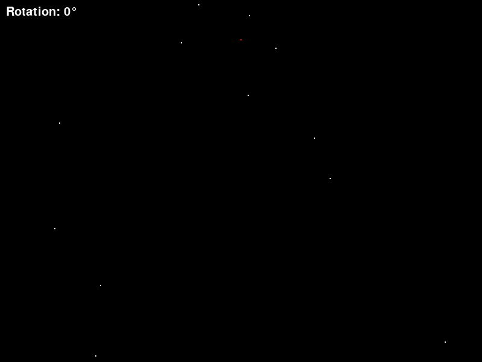

# Night Sky

Night Sky is a simple Python program that generates a random starry sky and allows you to explore it by rotating your view. You can adjust the field of view and navigate through the sky using the arrow keys. The program also provides the option to take screenshots of the current view.

## Features

- Randomly generated stars spread across the sky.
- Field of view adjustment to control the visible portion of the sky.
- Rotation control to explore the sky in different directions.
- Screenshot capture to save the current view as an image.

## Requirements

- Python 3.x
- Pygame library

## Installation

- Clone the repository or download the source code.
- Install the required Pygame library by running the following command:

    pip install pygame

## Usage

- Run the main.py file to start the program.

    python3 NightSky.py

- Use the arrow keys to rotate your view and explore the starry sky.
- Press the 's' key to capture a screenshot of the current view. The screenshot will be saved in the screenshots folder.
- Close the program window to exit.

## Configuration

The behavior of the Night Sky program can be customized through the config.py file. Modify the settings in the file according to your preferences.

- WIDTH and HEIGHT: Dimensions of the program window.
- FIELD_OF_VIEW: Field of view angle in degrees.
- NUM_STARS: Number of stars to generate.
- clock_speed: Frame rate of the program.

## Contributing

Contributions to the Night Sky program are welcome! If you find any issues or have suggestions for improvements, feel free to create a pull request or submit an issue on the GitHub repository.

## License

Night Sky is released under the MIT License. You are free to modify and distribute the code according to the terms of the license.